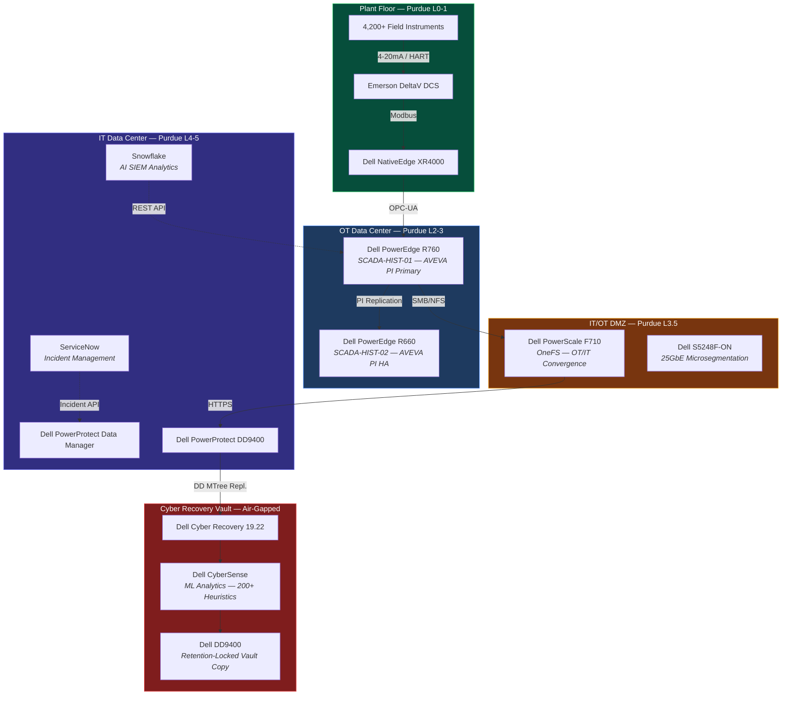
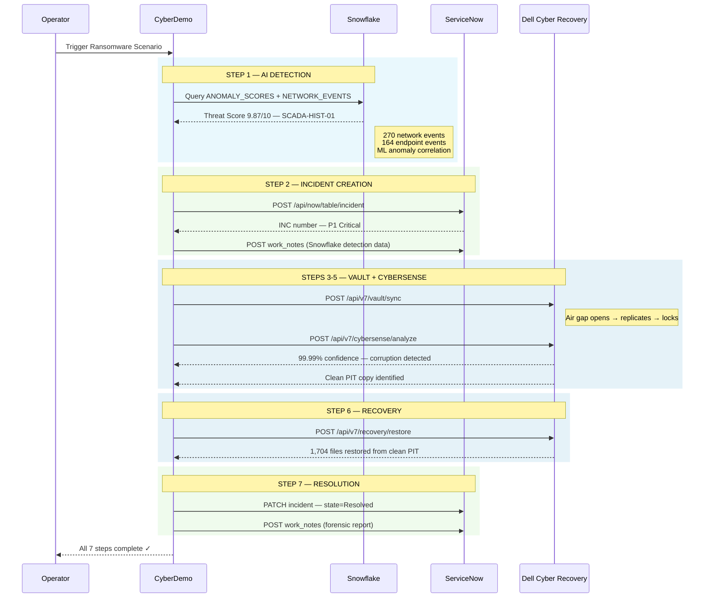
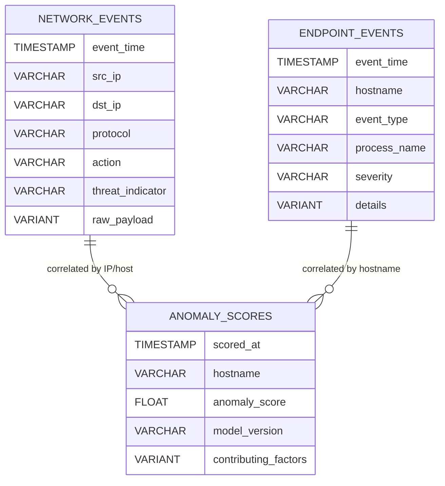
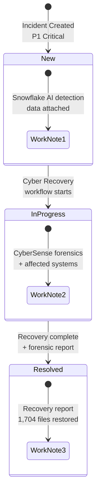
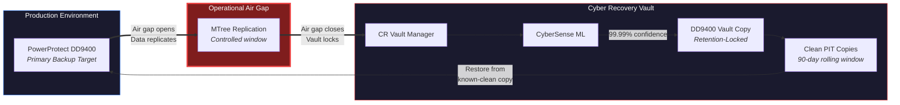

<div align="center">

# CyberDemo

### Automated Cyber Recovery for Pharmaceutical Manufacturing

**Snowflake AI Detection** | **ServiceNow Incident Orchestration** | **Dell Cyber Recovery**

[](https://python.org)
[](https://fastapi.tiangolo.com)
[](https://snowflake.com)
[](https://servicenow.com)
[](https://dell.com/en-us/lp/dt/cyber-resilience-solutions)

---

*A fully integrated, live-fire demo that orchestrates ransomware detection, incident response, and air-gapped recovery across three enterprise platforms — in under two minutes.*

</div>

---

## The Problem

> Ransomware attacks on pharmaceutical manufacturing cost the industry an estimated **$50–100M per incident** when you factor in production downtime ($500K–$2M/day), regulatory penalties (FDA 483 observations, consent decrees), product recalls, and reputational damage.

Most cyber recovery demos are slide decks. This one is **real**.

CyberDemo connects to **live Snowflake**, **live ServiceNow**, and **Dell Cyber Recovery APIs** to execute a complete detection-to-recovery workflow against a realistic pharma OT environment — SCADA historians, MES systems, and GxP-regulated data.

---

## What It Does

```
Ransomware hits SCADA historian at 2 AM
        │
        ▼
┌─────────────────────────────────────────────────────────────┐
│                    CyberDemo Orchestrator                    │
│                                                             │
│   Snowflake ──→ ServiceNow ──→ Dell Cyber Recovery          │
│   detects        creates        isolates, analyzes,         │
│   the threat     the ticket     and recovers                │
│                                                             │
└─────────────────────────────────────────────────────────────┘
        │
        ▼
Full recovery in < 2 minutes. No ransom paid.
```

---

## Architecture



---

## The 7-Step Orchestration

Every scenario runs through a fully automated pipeline — streamed to the browser in real time via Server-Sent Events.



---

## Snowflake Integration

CyberDemo uses Snowflake as a **real-time AI-powered SIEM analytics engine**. This isn't a mock — it queries live Snowflake infrastructure.

### Data Model



### Detection Query

The anomaly detection runs a multi-table correlation — joining network events, endpoint telemetry, and ML anomaly scores to produce a ranked threat assessment:

| Metric | Value |
|--------|-------|
| Network events analyzed | 270 |
| Endpoint events analyzed | 164 |
| ML model | Anomaly Scoring v2.1 |
| Primary threat score | 9.87 / 10.0 |
| Detection latency | < 3 seconds |

The Snowflake query identifies C2 callbacks, shadow copy deletion, lateral SMB movement, and correlates them into a single threat score — giving the SOC team (or automation) a definitive signal to act on.

---

## ServiceNow Integration

CyberDemo creates and manages **real ServiceNow incidents** via the Table API — no mocks, no stubs.



Each incident includes:
- **Automated creation** with correct priority, category, and assignment group
- **Work notes** populated from Snowflake detection and CyberSense forensics
- **Auto-resolution** with close code, close notes, and full recovery documentation
- **Audit trail** — every API call is a timestamped, traceable action

---

## Dell Cyber Recovery — The Air Gap

The core value proposition: an **air-gapped, immutable vault** that ransomware cannot reach.



### CyberSense Analytics

| Capability | Detail |
|-----------|--------|
| Detection confidence | 99.99% |
| Heuristics | 200+ corruption signatures |
| Analysis scope | Full-content inspection (not just metadata) |
| Clean copy identification | Automatic PIT selection pre-attack |
| Supported platforms | DD, PowerScale, PowerStore |

---

## Infrastructure Map

CyberDemo includes an **interactive infrastructure diagram** showing the complete BaselPharma OT/IT stack built on Dell Technologies.

```
┌──────────────┐    ┌────────────────┐    ┌──────────────┐    ┌────────────────┐   ║         ║   ┌─────────────────┐
│  PLANT FLOOR │    │ OT DATA CENTER │    │  IT/OT DMZ   │    │ IT DATA CENTER │   ║ AIR GAP ║   │  CYBER VAULT    │
│  Purdue L0-1 │───▶│  Purdue L2-3   │───▶│  Purdue L3.5 │───▶│  Purdue L4-5   │══▶║         ║══▶│  Isolated       │
│              │    │                │    │              │    │                │   ║         ║   │                 │
│ NativeEdge   │    │ PowerEdge R760 │    │ PowerScale   │    │ PPDM           │   ║         ║   │ Cyber Recovery  │
│ XR4000       │    │ PowerEdge R660 │    │ F710 OneFS   │    │ DD9400         │   ║         ║   │ CyberSense      │
│ DeltaV DCS   │    │ AVEVA PI       │    │ S5248F-ON    │    │ Snowflake (SaaS)│  ║         ║   │ DD9400 Vault    │
│ Instruments  │    │                │    │              │    │ ServiceNow(SaaS)│  ║         ║   │                 │
└──────────────┘    └────────────────┘    └──────────────┘    └────────────────┘   ║         ║   └─────────────────┘
                                                                                   ║         ║
                                                                                   Lock icon
```

**Features:**
- Hover any Dell product to see it glow with specs and role
- **Attack visualization** — toggle to see the LockBit kill chain: compromised components pulse red, at-risk components pulse amber, vault products glow green (air-gapped and safe)
- Purdue Model level indicators with network segmentation details
- Realistic VLAN and IP addressing

---

## Business Impact

### Without Cyber Recovery

| Risk | Impact |
|------|--------|
| Production downtime | $500K – $2M / day per line |
| Ransom payment | $5M – $50M (LockBit typical) |
| FDA 483 / Warning Letter | GxP data integrity loss |
| Product recall | Brand + patient safety |
| Consent decree | $100M+ regulatory action |
| Total exposure | **$50M – $100M+** |
| Recovery time | **3 – 6 weeks** (if recoverable at all) |

### With CyberDemo Workflow

| Metric | Result |
|--------|--------|
| Detection to recovery | **< 2 minutes** |
| Ransom paid | **$0** |
| Data loss | **None** — restored from clean PIT |
| Regulatory findings | **None** — full audit trail |
| Production downtime | **Minutes, not weeks** |
| Incident documentation | **Automated** — ServiceNow + work notes |

---

## Tech Stack

| Layer | Technology | Purpose |
|-------|-----------|---------|
| **Backend** | Python 3.11+ / FastAPI | API server, SSE streaming, orchestration |
| **Frontend** | Alpine.js / Tailwind CSS / HTMX | Reactive dashboard, real-time updates |
| **AI Detection** | Snowflake (CYBER_SECURITY DB) | SIEM telemetry, ML anomaly scoring |
| **Incident Mgmt** | ServiceNow (Table API) | Automated P1 incident lifecycle |
| **Cyber Recovery** | Dell CR API v7 / CyberSense | Air-gapped vault, ML forensics |
| **Data Protection** | Dell PowerProtect DD | Dedup backup, MTree replication |
| **OT/IT Storage** | Dell PowerScale OneFS | Multiprotocol convergence layer |
| **Edge Compute** | Dell NativeEdge | Plant floor containerized workloads |
| **Streaming** | Server-Sent Events (SSE) | Real-time step-by-step UI updates |

---

## Quick Start

```bash
# Clone
git clone https://github.com/sebdallais-git/CyberDemo.git
cd CyberDemo

# Configure
cp .env.example .env
# Edit .env with your Snowflake, ServiceNow, and Dell CR credentials

# Install
python -m venv .venv && source .venv/bin/activate
pip install -r requirements.txt

# Start mock Dell CR server (if not using a real CR instance)
python -m mock_dellcr.server &

# Launch
python -m app.main
# Dashboard → http://localhost:8889
```

### Environment Variables

| Variable | Description |
|----------|-------------|
| `SNOWFLAKE_ACCOUNT` | Snowflake account identifier |
| `SNOWFLAKE_USER` | Snowflake username |
| `SNOWFLAKE_PASSWORD` | Snowflake password |
| `SNOW_INSTANCE_URL` | ServiceNow instance (e.g., `https://dev12345.service-now.com`) |
| `SNOW_USER` / `SNOW_PASSWORD` | ServiceNow API credentials |
| `DELLCR_MODE` | `mock` or `live` |
| `DELLCR_BASE_URL` | Dell CR API endpoint |
| `APP_PORT` | Dashboard port (default: 8889) |

---

## Pages

| Route | Description |
|-------|-------------|
| `/` | Main dashboard — scenario triggers, live timeline, detection panels |
| `/infrastructure` | Interactive OT/IT infrastructure map (Purdue Model) |
| `/infrastructure?state=attacked` | Infrastructure with LockBit kill chain visualization |
| `/teleprompter` | Auto-scrolling teleprompter for demo video recording |
| `/health` | Health check endpoint |
| `/api/status` | Connectivity status for all three platforms |

---

## Key Differentiators

**For Pharma CIOs & CISOs:**
- Demonstrates a complete, auditable recovery workflow for GxP-regulated environments
- Maps to Purdue Model architecture — the standard for pharma OT security
- Every action is documented in ServiceNow — ready for FDA inspection

**For Security Architects:**
- Real Snowflake AI queries against SIEM telemetry — not simulated
- Multi-table ML correlation: network events + endpoint events + anomaly scores
- Air-gapped vault with CyberSense full-content inspection

**For Enterprise Platform Teams:**
- Clean REST API integration patterns for Snowflake, ServiceNow, and Dell CR
- SSE-based real-time streaming architecture
- Infrastructure-as-code approach with Dell reference architecture

---

## Project Structure

```
CyberDemo/
├── app/
│   ├── main.py                 # FastAPI app, routes, SSE endpoint
│   ├── orchestrator.py         # 7-step workflow engine
│   ├── snowflake_client.py     # Snowflake anomaly detection queries
│   ├── servicenow_client.py    # ServiceNow Table API client
│   ├── dellcr_client.py        # Dell CR REST API v7 client
│   ├── config.py               # Environment configuration
│   └── models.py               # Pydantic models (SSE events, requests)
├── mock_dellcr/
│   ├── server.py               # Mock Dell CR API server
│   ├── vault.py                # Vault state machine
│   ├── cybersense.py           # Mock CyberSense analysis
│   └── data.py                 # Pharma-specific mock data
├── templates/
│   ├── dashboard.html          # Main dashboard
│   ├── infrastructure.html     # Interactive infra diagram + attack viz
│   ├── teleprompter.html       # Dual-script auto-scroll prompter
│   ├── base.html               # Layout template
│   └── partials/               # Timeline, panels, cards
├── static/
│   ├── js/app.js               # Alpine.js dashboard component
│   └── css/custom.css          # Animations and custom styles
├── .env.example                # Environment template
├── requirements.txt
└── Makefile
```

---

<div align="center">

**Built in Basel for the pharma industry.**

*Snowflake AI Detection* · *ServiceNow Orchestration* · *Dell Cyber Recovery*

</div>
